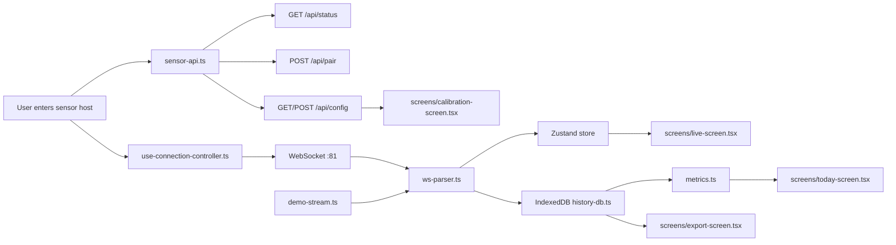

# Architecture

## Goal

Tholus Flow Lite is intentionally small: one doorway sensor, one browser, local-first history, no backend requirement for v1.

The architecture keeps the firmware-facing logic isolated from the UI so a future sync adapter or hosted storage layer can be added later without rewriting the app.

The UI layer also deliberately ports the visual system from the Tholus Flow design explorations into a clean web implementation, without carrying over private macOS app code.

## App Structure

```text
src/
  App.tsx
  components/
    app-shell.tsx
    brand-mark.tsx
    sensor-grid.tsx
    ui.tsx
  hooks/
    use-connection-controller.ts
    use-history.ts
  lib/
    date.ts
    demo-stream.ts
    export.ts
    history-db.ts
    metrics.ts
    sensor-api.ts
    types.ts
    ws-parser.ts
  screens/
    calibration-screen.tsx
    connect-screen.tsx
    export-screen.tsx
    live-screen.tsx
    today-screen.tsx
  store/
    app-store.ts
```

## Data Flow



## WebSocket Handling

The firmware is treated as the source of truth.

Expected stream messages:

- `frame`
- `tracks`
- `count`
- `diag`
- `subscribed`

`ws-parser.ts` normalizes these messages into small typed objects:

- `SensorFrame`
- `SensorTrack[]`
- `CountEventRecord` payloads
- `SensorDiagnostic`

Fallback support is included for legacy CSV frames, but the app prefers `json_v2`.

## Local Persistence Model

IndexedDB stores two record families:

### `count-events`

- event id
- sensor id
- sensor label
- host
- source (`hardware` or `demo`)
- direction
- distance in mm
- confidence
- timestamp

### `status-snapshots`

- snapshot id
- sensor id
- host
- source
- timestamp
- paired flag
- Wi-Fi flag
- sensor ready flag
- queue depth
- last error
- firmware version
- protocol version

The UI store itself is persisted separately with Zustand for:

- recent sensors
- active sensor selection
- current app view
- current mode (`hardware` or `demo`)

## Metrics Aggregation

`metrics.ts` computes derived values from stored count events:

- hourly buckets
- daily summaries
- 7-day summaries
- occupancy estimate
- peak occupancy estimate
- peak hour
- recent activity strip
- confidence pulse

Occupancy is intentionally described as an estimate.

The app does not invent precision beyond the event stream:

- counts are directional threshold crossings
- occupancy is net `IN - OUT`
- negative values are clamped at zero

## Screen Responsibilities

### Connect

- status check
- pairing
- recent sensors
- demo mode entry

### Live

- live radar
- tracks
- `IN / OUT`
- occupancy estimate
- confidence pulse
- event stream

### Today

- daily totals
- peak hour
- hourly chart
- 7-day trend
- insights

### Calibration

- live preview
- `countingLineRow`
- `topToBottomIsIn`
- `roiMask`
- `heightThreshold`
- `maxTracks`
- `eventConfidenceMin`

### Export

- CSV export
- JSON export
- JSON import
- presentable summary card

## Visual System

The browser UI is based on the Tholus Flow design folder and ports its key choices into web-native components:

- warm neutral surfaces and paper-like backgrounds in `src/index.css`
- Geist and Geist Mono typography
- the doorway brand mark in `src/components/brand-mark.tsx`
- the dark radar stage and signal-green motion language
- a compact sidebar shell that keeps the app feeling product-like instead of dashboard-generic

## Future Extension Points

- optional Supabase sync adapter beside `history-db.ts`
- a multi-sensor mode built on top of the same event model
- richer calibration presets
- printable reports
- optional queue or occupancy heatmaps
