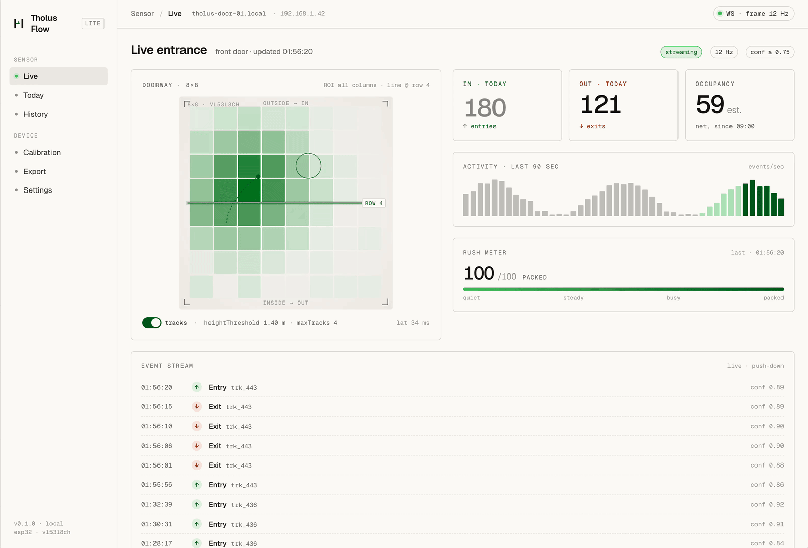
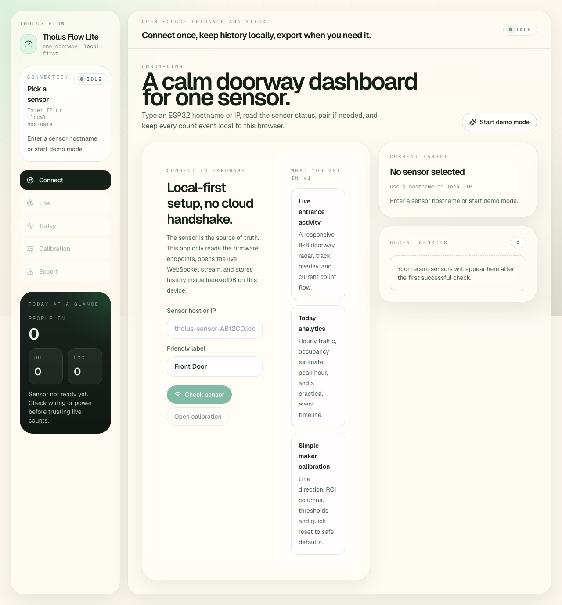
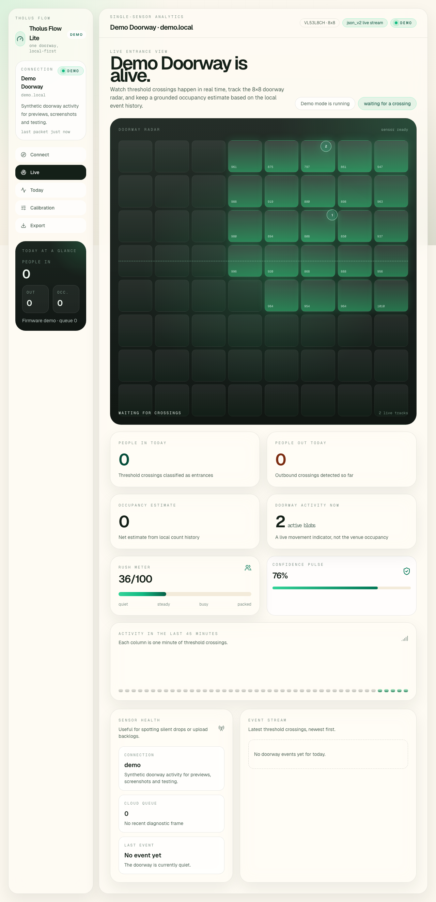
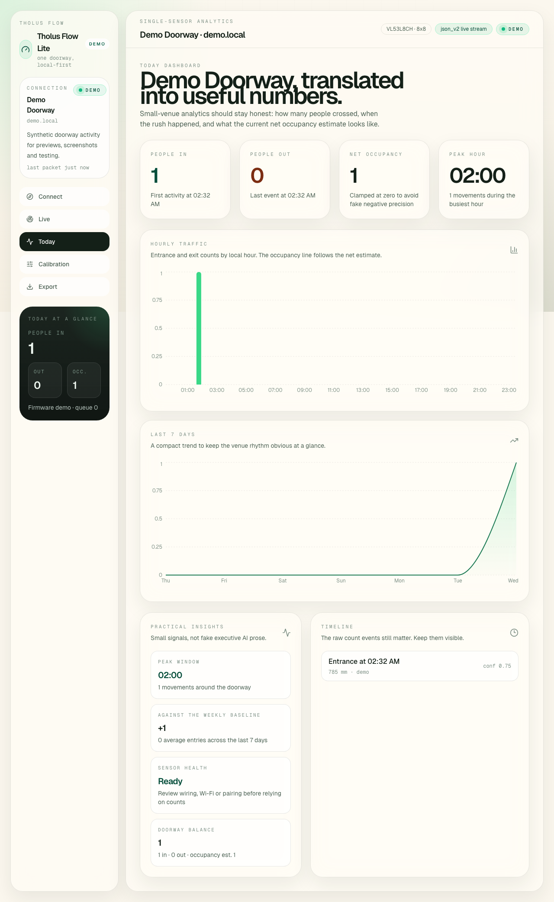

# Tholus Flow Lite

Beautiful open-source entrance analytics for one ESP32 + VL53L8CH doorway sensor.

Beta 0.1 · MIT · local-first · one doorway, not a platform



Tholus Flow Lite is a small web app for small shops, bars, pop-up venues, studios, galleries, event spaces, and makers who want a satisfying live entrance counter without signing up for a cloud product.

It connects directly to a single sensor over the local network, reads the existing firmware API, stores history in the browser, and turns raw doorway activity into a calm dashboard that actually feels good to use.

## Why This Exists

Most people-counting tools are either:

- overbuilt fleet dashboards
- ugly admin software
- locked behind accounts and cloud setup
- too heavy for one doorway and one sensor

Tholus Flow Lite keeps the useful part:

- connect to one ESP32 sensor
- watch the doorway live
- count `IN / OUT`
- estimate occupancy honestly
- save history locally
- calibrate without leaving the browser
- export the data when you need it

## What You Get In v0.1 beta

- Simple onboarding by IP or `.local` hostname
- Status probe with `GET /api/status`
- Optional pairing with `POST /api/pair`
- Live WebSocket stream over port `81`
- Animated 8×8 doorway radar with track overlay
- Today totals, peak hour, hourly traffic, and event timeline
- Local IndexedDB history persistence
- Lightweight calibration UI for counting line, direction, ROI, and thresholds
- CSV export plus JSON export/import
- Built-in demo mode for previews, screenshots, and testing

## Real Screens







## Designed To Feel Like A Product

This repo keeps the scope intentionally small, but aims to feel polished from day one.

The interface draws from the Tholus Flow design explorations, with:

- warm, paper-like neutrals
- Geist typography
- restrained card layouts
- a dark sensor stage for the live radar
- signal-green accents and subtle motion

The goal is to make entrance analytics feel premium, playful, and maker-friendly without turning into a bloated analytics suite.

## Who It's For

- Small retail spaces
- Bars and coffee counters
- Pop-up venues
- Studios and galleries
- Maker installations
- Anyone who wants one polished doorway counter and a clean local workflow

## Hardware Requirements

- ESP32
- VL53L8CH time-of-flight sensor
- Firmware exposing the expected Tholus Flow sensor routes

Supported endpoint assumptions:

- `GET /api/status`
- `GET /api/config`
- `POST /api/pair`
- `POST /api/config`
- `POST /api/wifi`
- `POST /api/restart`
- WebSocket on port `81`
- `json_v2` stream mode

More detail lives in [API_INTEGRATION.md](./API_INTEGRATION.md).

## Quick Start

You need:

- Node.js 20+ and npm
- a local copy of this repository

Clone the repo:

```bash
git clone https://github.com/darioriccio/tholus-flow-lite.git
```

Enter the project folder:

```bash
cd tholus-flow-lite
```

Install dependencies:

```bash
npm install
```

Start the app locally:

```bash
npm run dev
```

Open the local URL shown in the terminal. It is usually:

```text
http://localhost:5173
```

For LAN testing from another device:

```bash
npm run dev:host
```

Then open the local IP shown by Vite from another device on the same network.

Production build:

```bash
npm run build
```

This creates a production-ready static build in:

```text
dist/
```

Preview the production build locally:

```bash
npm run preview
```

Release check:

```bash
npm run check
```

`npm run check` runs linting and then builds the app, so it is a good final sanity check before publishing.

## Demo Mode

Tholus Flow Lite includes a built-in synthetic stream so the product can be previewed without hardware.

Demo mode simulates:

- live 8×8 frames
- moving tracks
- directional count events
- diagnostics
- changing confidence and activity levels

That makes it useful for:

- GitHub screenshots
- UI reviews
- calibration previews
- export flow checks
- design demos without an ESP32 on the desk

## Firmware Notes

This is a browser app, so the sensor firmware must support browser networking rules:

- CORS headers for the app origin
- `OPTIONS` preflight handling
- `Content-Type` and `Authorization` headers
- cross-origin `GET` and `POST`

If you are using the matching firmware from the wider Tholus project, see [API_INTEGRATION.md](./API_INTEGRATION.md) for the exact request and message assumptions.

## Project Layout

```text
src/
  components/         Shell, brand, sensor grid, UI primitives
  hooks/              Connection runtime and IndexedDB hydration
  lib/                Sensor API, parser, metrics, exports, demo stream
  screens/            Connect, live, today, calibration, export
  store/              Zustand UI/session store
docs/
  screenshots/        README motion and product screenshots
```

## What Was Reused From TholusOS

This project intentionally reuses generic ideas from the wider TholusOS sensor stack, not private desktop internals.

Concepts ported from the macOS codebase:

- sensor status and config shapes
- WebSocket `json_v2` parsing rules
- pairing assumptions
- count event normalization
- local occupancy estimation from directional events
- calibration parameters already exposed by firmware

Reimplemented cleanly in TypeScript:

- browser-first sensor client
- IndexedDB history layer
- metrics aggregation
- charts and export tooling
- demo stream
- full interface layer

## Documentation

- [ARCHITECTURE.md](./ARCHITECTURE.md)
- [API_INTEGRATION.md](./API_INTEGRATION.md)
- [LICENSE](./LICENSE)

## Roadmap

The point of this repository is to stay small. Future work should extend the product carefully, not turn it into a platform.

Possible next steps:

- optional Supabase sync adapter
- saved calibration presets
- multi-door comparison as a separate mode
- printable daily report
- more advanced trend views without sacrificing simplicity

## Built By

Tholus Flow Lite comes from the wider work around spatial interfaces, sensing, and interactive systems at **the usual next**.

If you like the tone of this project and want to see the broader studio practice, visit [theusualnext.com](https://theusualnext.com).

## License

MIT. See [LICENSE](./LICENSE).
